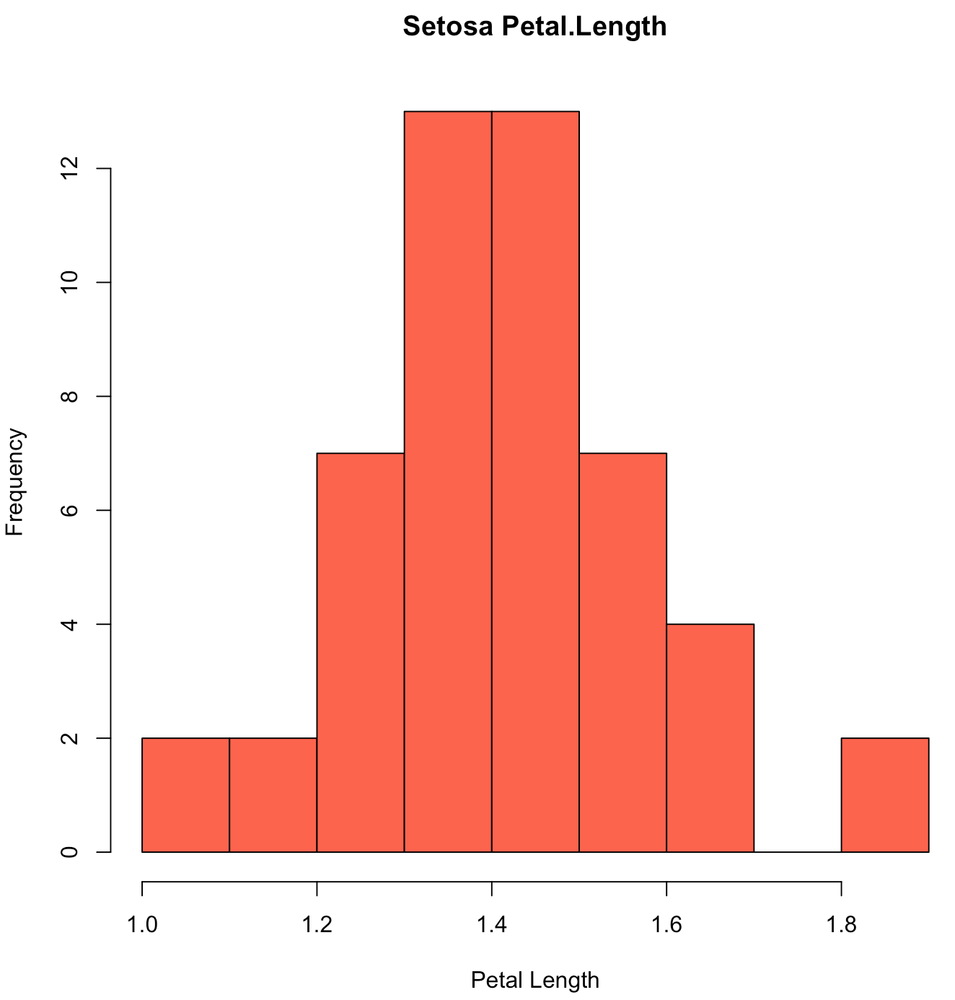
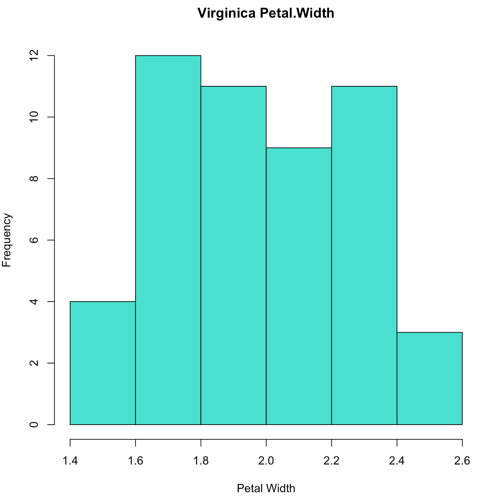

#Data Mining and Machine Learning in Bioinformatics  
Exercise Series 1 

Group members (Name, Student ID, E-Mail):  

* Baldomero Valdez,  Valenzuela, 2905175, baldmer.w@gmail.com
* Omar Trinidad Gutierrez Mendez, 2850441, omar.vpa@gmail.com
* Shinho Kang, 2890169, wis.shinho.kang@gmail.com

- - -

#####a) Compute a 150 x 150 Euclidean distance matrix between flowers.

######CODE

	# Implemented in two ways - using dist(), and using self-created function	
	# function for calculating Euclidean Distance
	euclidean_distance <- function(p, q) {
	    ed = 0
	    for (i in 1:4) {
	        ed <- ed + (p[,i] - q[,i]) ^ 2
	    }
	    ed <- sqrt(ed)
	    return(ed)
	}
	
	data(iris) #load iris data
	iris2 <- iris[-5] # delete column 5 with string
	# compute distances using dist() function
	distances <- as.matrix(dist(head(iris2, size)))
	
	# compute distances using self-created function
	distances2 <- matrix(nrow=size, ncol=size)
	for (p in 1:size) {
	  for (q in 1:size) {
	    row_p = iris2[p,]
	    row_q = iris2[q,]
	    distances2[p, q] <- euclidean_distance(row_p, row_q)
	  }
	}
	
#####b) Given that distance matrix calculate for each flower its so-called nearest neighbor (i.e. the one, which is most similar to it).
######CODE
	
	Flower = c()
	Species = c()
	Nearest.neighbor = c()
	NN.species = c()
	
	for (i in 1:size) {
	    Flower[i] <- i
	    Species[i] <- levels(iris$Species)[iris[i, 5]] # convert the factor to string
	
	    # find the nearest neighbor using sort
	    line = distances2[i,]
	    nn = sort(line)[2] # first one is itself, so choose 2
	    index_nn = which(line == nn)
	    Nearest.neighbor[i] <- index_nn
	    NN.species[i] <- levels(iris$Species)[iris[index_nn, 5]]
	}
	
	data_frame = data.frame(Flower, Species, Nearest.neighbor, NN.species)
	#print(data_frame)
	write.csv(data_frame, file = "EX_B_distance.csv")

#####c) Calculate the percentage of flowers of species X that has a nearest neighbor of species Y. The output should be a 3 x 3 matrix X (because there are 3 species).
######CODE
	cc = table ( data_frame$Species, data_frame$NN.species ) [,]
	write.csv(cc, file = "EX_C_distance_3x3.csv")
######RESULT
	             setosa versicolor virginica
	  setosa         50          0         0
	  versicolor      0         47         3
	  virginica       0          3        47

#####d) Generate three grouped barplots
######CODE
	barplot(cc, main="Number of Nearest Neighbors", xlab="Species", ylab="Numbers", col=c("darkblue", "red", "gray"), legend = rownames(cc), beside=TRUE)
######RESULT

#####e) Generate histograms
######CODE
	# setosa
	
	setosa <- iris[iris$Species == 'setosa',]
	
	hist(setosa$Sepal.Length, col="Tomato", main="Setosa Sepal.Length", xlab="Sepal Length")
	hist(setosa$Sepal.Width, col="Tomato", main="Setosa Sepal.Width", xlab="Sepal Width")
	hist(setosa$Petal.Length, col="Tomato", main="Setosa Petal.Length", xlab="Petal Length")
	hist(setosa$Petal.Width, col="Tomato", main="Setosa Petal.Width", xlab="Petal Width")
	
	# versicolor
	
	versicolor <- iris[iris$Species == 'versicolor',]
	
	hist(versicolor$Sepal.Length, col="Violet", main="Versicolor Sepal.Length", xlab="Sepal Length")
	hist(versicolor$Sepal.Width, col="Violet", main="Versicolor Sepal.Width", xlab="Sepal Width")
	hist(versicolor$Petal.Length, col="Violet", main="Versicolor Petal.Length", xlab="Petal Length")
	hist(versicolor$Petal.Width, col="Violet", main="Versicolor Petal.Width", xlab="Petal Width")
	
	# virginica
	
	virginica <- iris[iris$Species == 'virginica',]
	
	hist(virginica$Sepal.Length, col="Turquoise", main="Virginica Sepal.Length", xlab="Sepal Length")
	hist(virginica$Sepal.Width, col="Turquoise", main="Virginica Sepal.Width", xlab="Sepal Width")
	hist(virginica$Petal.Length, col="Turquoise", main="Virginica Petal.Length", xlab="Petal Length")
	hist(virginica$Petal.Width, col="Turquoise", main="Virginica Petal.Width", xlab="Petal Width")

######RESULT

##### f) Explain in your own words what a histogram visualizes and how you have to interpret the figure.

A histogram visualizes a distribution of numerical data. The y-axis shows how frequently the values on the x-axis occur in the data, the bars represent ranges of values on the x-axis.

######Figures description
#######Setosa Sepal.Length

It is observed that the higher frequencies are defined between the range of 4.5 - 5.5, having a maximum frequency approximately of 15 units.

#######Versicolor Sepal.Length

This figure shows a maximum frequency of approximately 20 units for Sepal lengths between
the range 5.5. and 6.0.

#######Virginica Sepal.Length

Higher frequencies are defined between the range of 6.0 - 6.5, with a frequency of approximately
of 20 units. There is an evenly distribution for values between the range of 7.0 - 8.0,
furthermore there are no Sepals with lengths in a range of 5.0 - 5.5.

#######Setosa Sepal.Width

The frequency reach its maximum of approximately 25 units for values defined between the range 3.0 - 3.5
and its minimum between 2.0 - 2.5.

#######Versicolor Sepal.Width

Increasing distribution of frequencies is observed between the range 2.0 - 3.0, reaching a maximum
of approximately 15 units between the range 2.8 - 3.0.

#######Virginica Sepal.Width

This figure shows a maximum frequencies of approximately 15 units for widths between 2.5 and 3.0.

#######Setosa Petal.Length

An evenly minimal distribution of frequencies is observed for lengths between the range 1.0 - 1.2
and greater than 1.8, the frequencies reach its maximum at a length of around
1.4 with approximately 15 units.

#######Versicolor Petal.Length

It is observed that the maximum frequency is reached between the range of 4.0 - 4.5 with a frequency
of a approximately 20 units, whereas the minimum length is between 5.0 - 5.5 with a a frequency of 1 unit.

#######Virginica Petal.Length

One can observe that the maximum frequency is evenly distributed for ranges 5.0 - 5.5 and 5.5 - 6.0 with
a maximum frequency of approximately 15 units.

#######Setosa Petal.Width

Most of the values of petal width are defined at its very minimum between the range 0.1 - 0.2 with
a frequency of approximately 35 units, the minimum is defined between the range 0.4 - 0.6.

#######Versicolor Petal.Width

The minimum frequency is defined between the range 1.6 - 1.8, whereas the maximum is defined
for widths of 1.2 or 1.3 with a frequency of approximately 15 units.

#######Virginica Petal.Width

Most of the frequencies are almost evenly distributed between the range 1.6 - 2.4, reaching their
maximum between the range 1.6 - 1.8.

#######General Comparison

Among the three groups of species, Virginica has the higher Sepal lengths frequency for values
between 6.0 ??? 6.5 and Satosa has the maximum Sepal widths for values between 3.0 and 3.5.

On the other side, Setosa specie presents the minimum Petal lengths with values between 1.0 - 1.8,
on the contrary, Virginica has the maximum petal lengths between the range 5.0 -  6.0. It is clear
to notice that species of type Setosa have the minimum widths of Petals.
