#Data Mining and Machine Learning in Bioinformatics  
Exercise Series 2 

Group members (Name, Student ID, E-Mail):  

* Baldomero Valdez,  Valenzuela, 2905175, baldmer.w@gmail.com
* Omar Trinidad Gutierrez Mendez, 2850441, omar.vpa@gmail.com
* Shinho Kang, 2890169, wis.shinho.kang@gmail.com


- - -

##Task 1  
#####a) Generate boxplots visualizing the distribution of values for each of the variables sepal length, sepal width, petal length and petal height. The boxplots should be plotted separately for each of the 3 species classes.

######CODE

	setosa <- iris[iris$Species == 'setosa',]
	versicolor <- iris[iris$Species == 'versicolor',]
	virginica <- iris[iris$Species == 'virginica',]
	
	boxplot(setosa[1:4], main="setosa", col=c("red","green","yellow","gray"), 
		names=colnames(iris)[1:4])
	boxplot(versicolor[1:4], main="versicolor", col=c("red","green","yellow","gray"), 
		names=colnames(iris)[1:4])
	boxplot(virginica[1:4], main="virginica", col=c("red","green","yellow","gray"), 
		names=colnames(iris)[1:4])

######RESULT
		
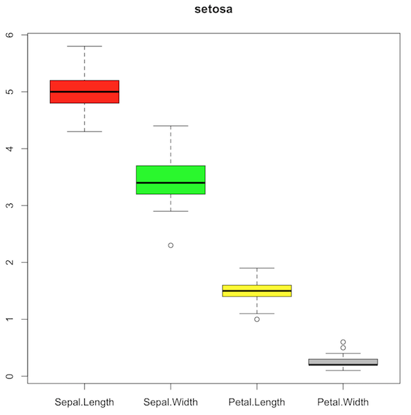
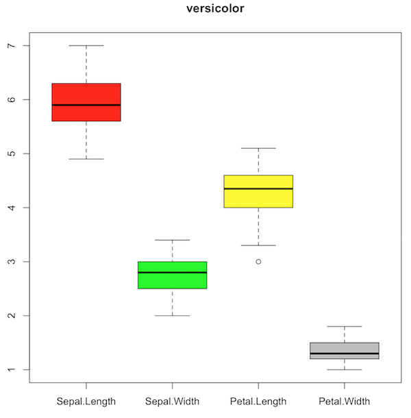
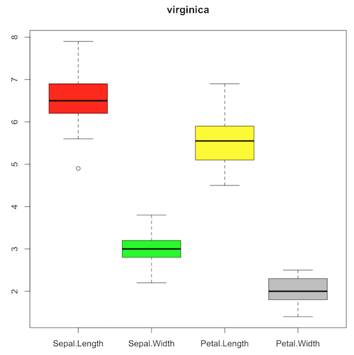


#####b) distribution skewness  
######EXPLANATION:  
Distribution Skewness: is a measure of the asymmetry of the probability distribution of a real-valued random variable about its mean. The skewness value can be positive or negative, or even undefined.

Negative skew:  
* Mean is greater than median.  
* The left tail is longer; the mass of the distribution is concentrated on the right of the figure.

Positive skew:  
* Mean is less than median.  
* The right tail is longer; the mass of the distribution is concentrated on the left of the figure.

Sepal Length and Width has positive skew.  
from the below density plot, we can see that the right tail is slightly longer than left tail on Sepal Length and Width.

Petal Length and Width has negative skew.  
from the below density plot of the petal length and width, we can see two hump but the most dense part is on the right side (slightly).

We also can say, the absolute of the skewness is bigger, the data is more concentrated on one-side.

######CODE
	(mean(iris$Sepal.Length) - median(iris$Sepal.Length)) / sd(iris$Sepal.Length)
	(mean(iris$Sepal.Width) - median(iris$Sepal.Width)) / sd(iris$Sepal.Width)
	(mean(iris$Petal.Length) - median(iris$Petal.Length)) / sd(iris$Petal.Length)
	(mean(iris$Petal.Width) - median(iris$Petal.Width)) / sd(iris$Petal.Width)

	d <- density(iris$Sepal.Length) # returns the density data 
	plot(d) # plots the results
	d <- density(iris$Sepal.Width) # returns the density data 
	plot(d) # plots the results
	d <- density(iris$Petal.Length) # returns the density data 
	plot(d) # plots the results
	d <- density(iris$Petal.Width) # returns the density data 
	plot(d) # plots the results
	
######RESULT
```Sepal.Length: 0.05233076```  
```Sepal.Width: 0.1315388```  
```Petal.Length: -0.3353541```  
```Petal.Width: -0.1320673```  


#####c) Calculate Pearson and Spearman rank correlations  

######EXPLANATION

Pearson's Correlation

+1: Perfect direct linear relationship (correlation)  
-1: Perfect decreasing linear relationship (anti-correlation)  
0: uncorrelated

One can observe that when considering the whole Iris data set, 
there is a decreasing linear relationship between the variables 

Petal.Width/Lenght and Sepal.Width, on the contrary there is 
an increasing correlation between the variables Sepal.Length 
and Petal.Width/Length.

In contrast when every group of species is analyzed
individually one can observe that there is only an 
increasing correlation. In the case of species type Setosa
the correlation between Sepal.Length and Petal.Width/Length 
reduces considerably.

One possible explanation for these discrepancies between
correlations is the existence/addition of "outliers" affecting
the measure when the data is correlated all together and individually. 


######CODE

	co <- cor(iris[1:4])
	corsp <- cor(iris[1:4], method="spearman")
	
	coSetosa <- cor(setosa[1:4])
	corspSetosa <- cor(setosa[1:4], method="spearman")
	
	coVersicolor <- cor(versicolor[1:4])
	corspVersicolor <- cor(versicolor[1:4], method="spearman")
	
	coVirginica <- cor(virginica[1:4])
	corspVirginica <- cor(virginica[1:4], method="spearman")

######RESULT
	
	> co
	             Sepal.Length Sepal.Width Petal.Length Petal.Width
	Sepal.Length    1.0000000  -0.1175698    0.8717538   0.8179411
	Sepal.Width    -0.1175698   1.0000000   -0.4284401  -0.3661259
	Petal.Length    0.8717538  -0.4284401    1.0000000   0.9628654
	Petal.Width     0.8179411  -0.3661259    0.9628654   1.0000000
	> corsp
	             Sepal.Length Sepal.Width Petal.Length Petal.Width
	Sepal.Length    1.0000000  -0.1667777    0.8818981   0.8342888
	Sepal.Width    -0.1667777   1.0000000   -0.3096351  -0.2890317
	Petal.Length    0.8818981  -0.3096351    1.0000000   0.9376668
	Petal.Width     0.8342888  -0.2890317    0.9376668   1.0000000
	> coSetosa
	             Sepal.Length Sepal.Width Petal.Length Petal.Width
	Sepal.Length    1.0000000   0.7425467    0.2671758   0.2780984
	Sepal.Width     0.7425467   1.0000000    0.1777000   0.2327520
	Petal.Length    0.2671758   0.1777000    1.0000000   0.3316300
	Petal.Width     0.2780984   0.2327520    0.3316300   1.0000000
	> corspSetosa
	             Sepal.Length Sepal.Width Petal.Length Petal.Width
	Sepal.Length    1.0000000   0.7553375    0.2788849   0.2994989
	Sepal.Width     0.7553375   1.0000000    0.1799110   0.2865359
	Petal.Length    0.2788849   0.1799110    1.0000000   0.2711414
	Petal.Width     0.2994989   0.2865359    0.2711414   1.0000000
	> coVersicolor
	             Sepal.Length Sepal.Width Petal.Length Petal.Width
	Sepal.Length    1.0000000   0.5259107    0.7540490   0.5464611
	Sepal.Width     0.5259107   1.0000000    0.5605221   0.6639987
	Petal.Length    0.7540490   0.5605221    1.0000000   0.7866681
	Petal.Width     0.5464611   0.6639987    0.7866681   1.0000000
	> corspVersicolor
	             Sepal.Length Sepal.Width Petal.Length Petal.Width
	Sepal.Length    1.0000000   0.5176060    0.7366251   0.5486791
	Sepal.Width     0.5176060   1.0000000    0.5747272   0.6599826
	Petal.Length    0.7366251   0.5747272    1.0000000   0.7870096
	Petal.Width     0.5486791   0.6599826    0.7870096   1.0000000
	> coVirginica
	             Sepal.Length Sepal.Width Petal.Length Petal.Width
	Sepal.Length    1.0000000   0.4572278    0.8642247   0.2811077
	Sepal.Width     0.4572278   1.0000000    0.4010446   0.5377280
	Petal.Length    0.8642247   0.4010446    1.0000000   0.3221082
	Petal.Width     0.2811077   0.5377280    0.3221082   1.0000000
	> corspVirginica
	             Sepal.Length Sepal.Width Petal.Length Petal.Width
	Sepal.Length    1.0000000   0.4265165    0.8243234   0.3157721
	Sepal.Width     0.4265165   1.0000000    0.3873587   0.5443098
	Petal.Length    0.8243234   0.3873587    1.0000000   0.3629133
	Petal.Width     0.3157721   0.5443098    0.3629133   1.0000000
	
#####d) visualize the correlation matrices calculated in c) via heatmaps.

######EXPLANATION
using the heat.colors color scheme, 
heat map displays correlation matrix values as color.  
the map is symmetric.  
color is bright yellow if the value is close to 1.  
color is red if the value is close to lowest value of the map.

Bacause each matrix has different range of correlation, 
each map shows relative difference of correlation in the matrix.

######CODE
	pdf('my_test.pdf',width=8,height=8,paper='special') 
	library("lattice")
	# displays Pearson's Correlation
	levelplot(co, colorkey = T, region = T, main="Iris data set", sub="Pearson's Correlation", 
	          col.regions=heat.colors, xlab="", ylab="")
	levelplot(coSetosa, colorkey = T, region = T, main="Setosa", sub="Pearson's Correlation", 
	          col.regions=heat.colors, xlab="", ylab="")
	levelplot(coVersicolor, colorkey = T, region = T, main="Versicolor", sub="Pearson's Correlation", 
	          col.regions=heat.colors, xlab="", ylab="")
	levelplot(coVirginica, colorkey = T, region = T, main="Virginica", sub="Pearson's Correlation", 
	          col.regions=heat.colors, xlab="", ylab="")
	
	# displays spearman's Correlation
	levelplot(corsp, colorkey = T, region = T, main="Iris data set", sub="Spearman's Correlation", 
	          col.regions=heat.colors, xlab="", ylab="")
	levelplot(corspSetosa, colorkey = T, region = T, main="Setosa", sub="Spearman's Correlation", 
	          col.regions=heat.colors, xlab="", ylab="")
	levelplot(corspVersicolor, colorkey = T, region = T, main="Versicolor", sub="Spearman's Correlation", 
	          col.regions=heat.colors, xlab="", ylab="")
	levelplot(corspVirginica, colorkey = T, region = T, main="Virginica", sub="Spearman's Correlation", 
	          col.regions=heat.colors, xlab="", ylab="")
	
	dev.off()

######RESULT

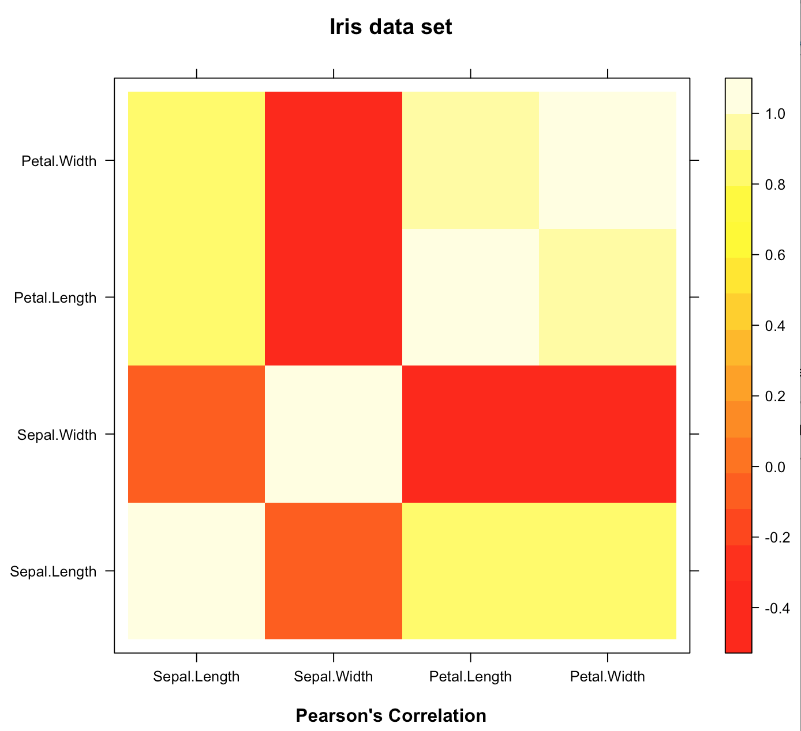
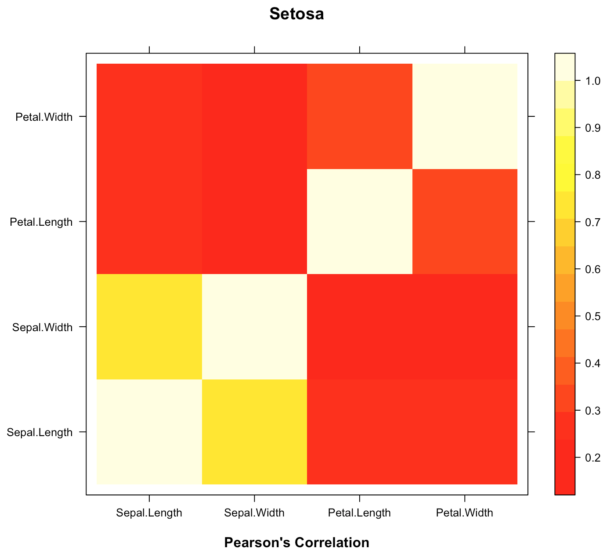
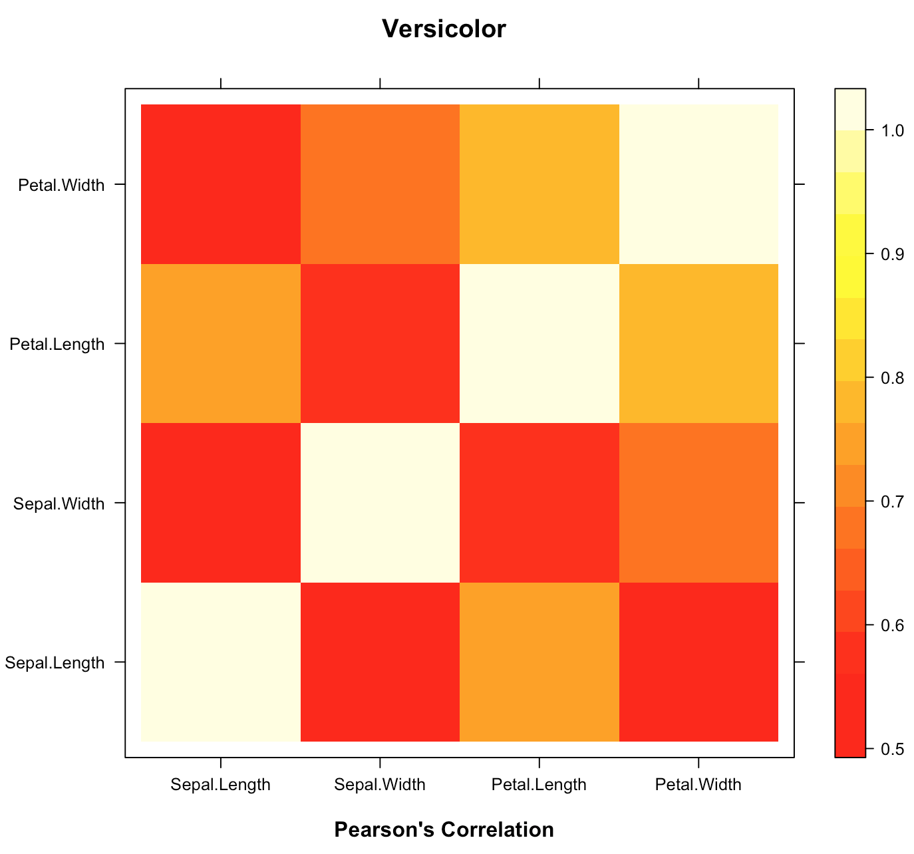
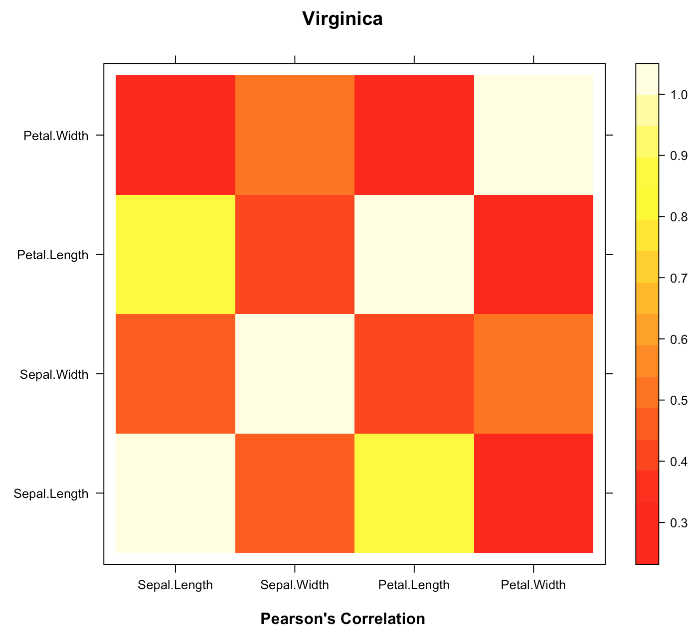
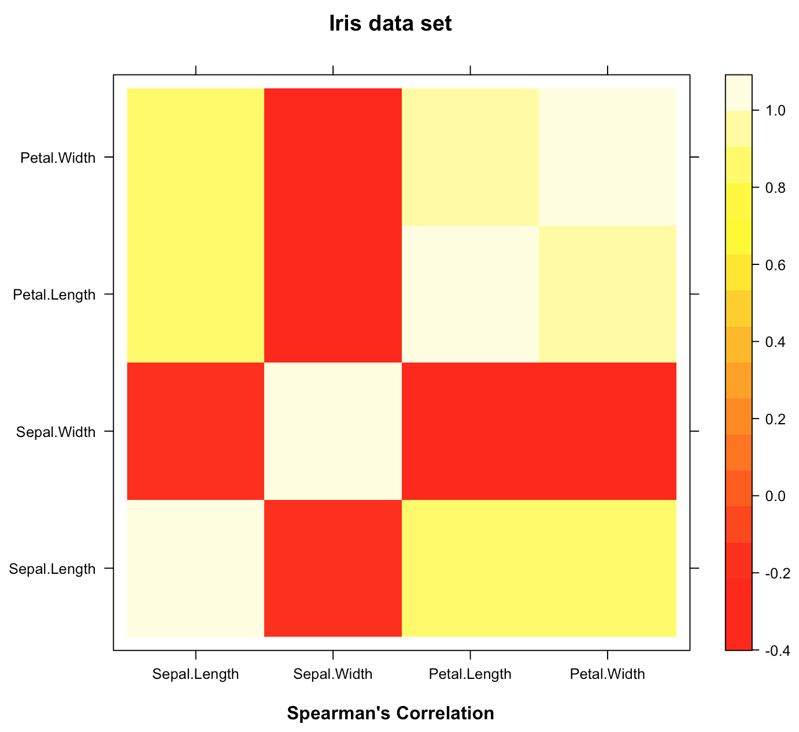
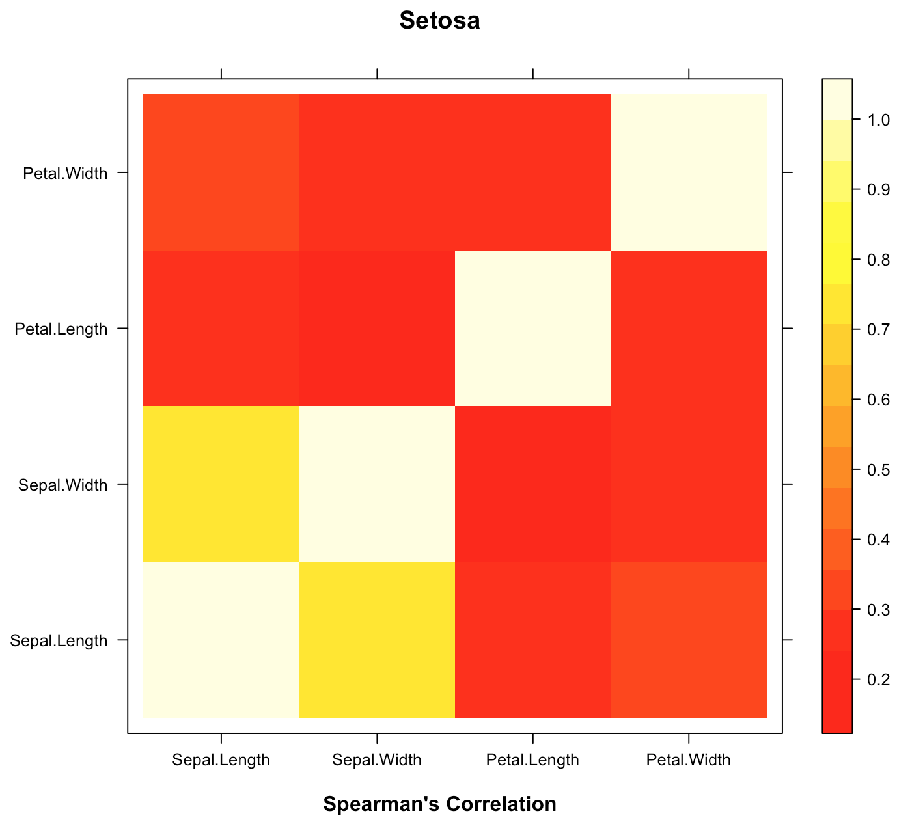
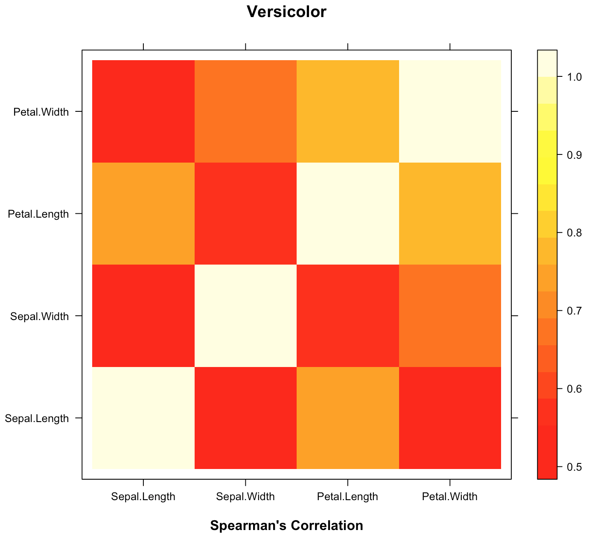


<br/>
##Task 2  
#####a-i) Calculate the mean and variance for x and y
######CODE
	dat = read.csv("exercise2-2.csv")
	
	# Here we calculate the mean and the variance for each colum in the dat dataset
	meanByCol = apply(dat, 2, mean)
	varByCol = apply(dat, 2, var)
	sdByCol = apply(dat, 2, sd)
	
	meanByCol
	varByCol
	sdByCol

######RESULT
	
	> meanByCol
	      x1       y1       x2       y2       x3       y3       x4       y4 
	9.000000 7.500909 9.000000 7.500909 9.000000 7.500000 9.000000 7.500909 
	> varByCol
	       x1        y1        x2        y2        x3        y3        x4        y4 
	11.000000  4.127269 11.000000  4.127629 11.000000  4.122620 11.000000  4.123249 
	> sdByCol
	      x1       y1       x2       y2       x3       y3       x4       y4 
	3.316625 2.031568 3.316625 2.031657 3.316625 2.030424 3.316625 2.030579 

#####a-ii) Calculate the correlation between x and y
######CODE

	# A-ii
	# calculate correlation between X and Y.
	c1 = cor(dat$x1, dat$y1)
	c2 = cor(dat$x2, dat$y2)
	c3 = cor(dat$x3, dat$y3)
	c4 = cor(dat$x4, dat$y4)

######RESULT

	> c1
	[1] 0.8164205
	> c2
	[1] 0.8162365
	> c3
	[1] 0.8162867
	> c4
	[1] 0.8165214


#####a-iii) Linear regression
######CODE
	
	# A-iii
	# Here calculate the values for a and b, that will be used later to draw the regression line
	b1 <- c1 * sdByCol[1] / sdByCol[2]
	#b1 <- 0.5
	a1 <- meanByCol[2] - (b1 * meanByCol[1])
	
	b2 <- c2 * sqrt(varByCol[3]) / sqrt(varByCol[4])
	#b2 = 0.5
	a2 <- meanByCol[4] - (b1 * meanByCol[3])
	
	b3 <- c3 * sqrt(varByCol[5]) / sqrt(varByCol[6])
	#b3 <- 0.5
	a3 <- meanByCol[6] - (b1 * meanByCol[5])
	
	b4 <- c4 * sqrt(varByCol[7]) / sqrt(varByCol[8])
	#b4 <- 0.5
	a4 <- meanByCol[8] - (b1 * meanByCol[7])

######RESULT
	> b1
	1.332843 
	> b2
	1.332484 
	> b3
	1.333375 
	> b4
	1.333657 


#####b) For each data set plot the data in a scatter plot and add the regression line to the scatter plot.

######CODE

	plot(dat$x1, dat$y1, xlim=c(0, 20), ylim=c(-5,15), xlab="X1", ylab="Y1", main="X1-Y1 scatterplot")
	abline(a=a1, b=b1, col="red")
	#abline(lm(dat$y1~dat$x1), col="blue")
	
	plot(dat$x2, dat$y2, xlim=c(0, 20), ylim=c(-5,15), xlab="X2", ylab="Y2", main="X2-Y2 scatterplot")
	abline(a=a2, b=b2, col="red")
	#abline(lm(dat$y2~dat$x2), col="blue")
	
	plot(dat$x3, dat$y3, xlim=c(0, 20), ylim=c(-5,15), xlab="X3", ylab="Y3", main="X3-Y3 scatterplot")
	abline(a=a3, b=b3, col="red")
	#abline(lm(dat$y3~dat$x3), col="blue")
	
	plot(dat$x4, dat$y4, xlim=c(0, 20), ylim=c(-5,15), xlab="X4", ylab="Y4", main="X4-Y4 scatterplot")
	abline(a=a4, b=b4, col="red")
	#abline(lm(dat$y4~dat$x4), col="blue")

######EXPLANATION
	# With color red we draw a line using the equation line.
	# With color blue we draw a line using the `lm` function provide by R.
	
	# We can see that the case 3 is the data which better fits the regression line. Almost perfect. But it does exist an outlier value. 
	
	# If we compare the scatterplots and the correlation value that we calculated before we can check that...
	# 1. we have a very well distributed data, and a normal distribution.
	# 2. we can see a relationship between X and Y, this one is a functional relationship.
	# 3. we have a linear relationship between X and Y.
	# 4. we can see that is not a linear relationship, the outlier modifies markedly the regression line.
	
######RESULT

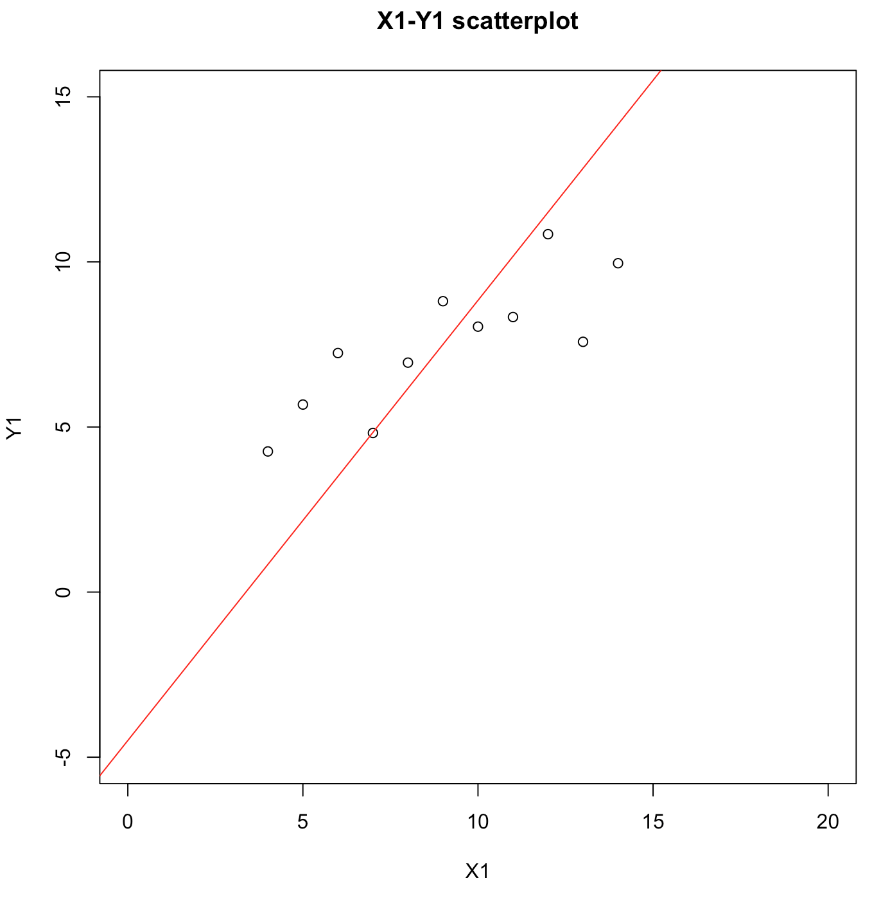
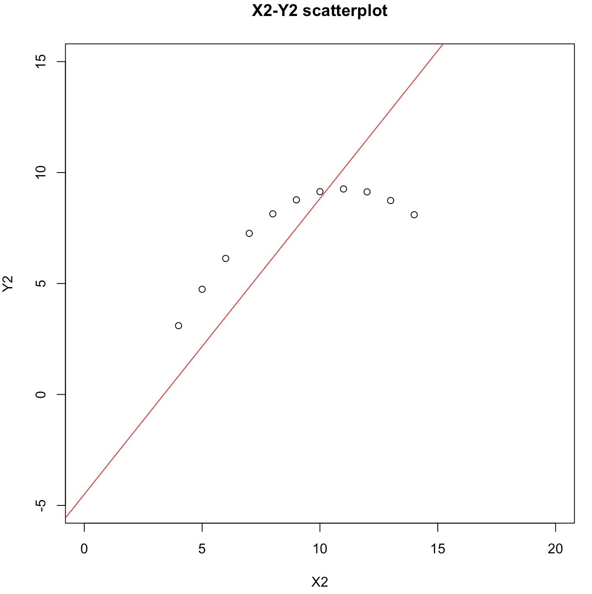
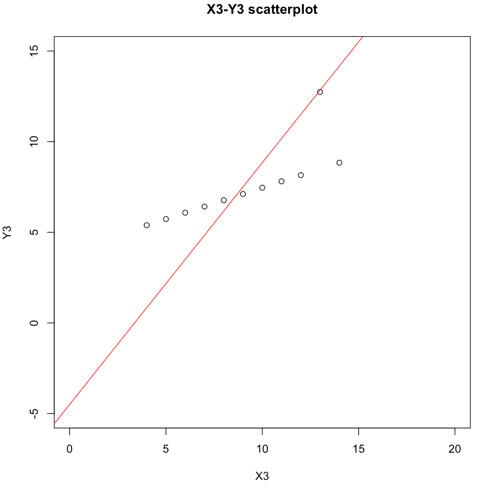
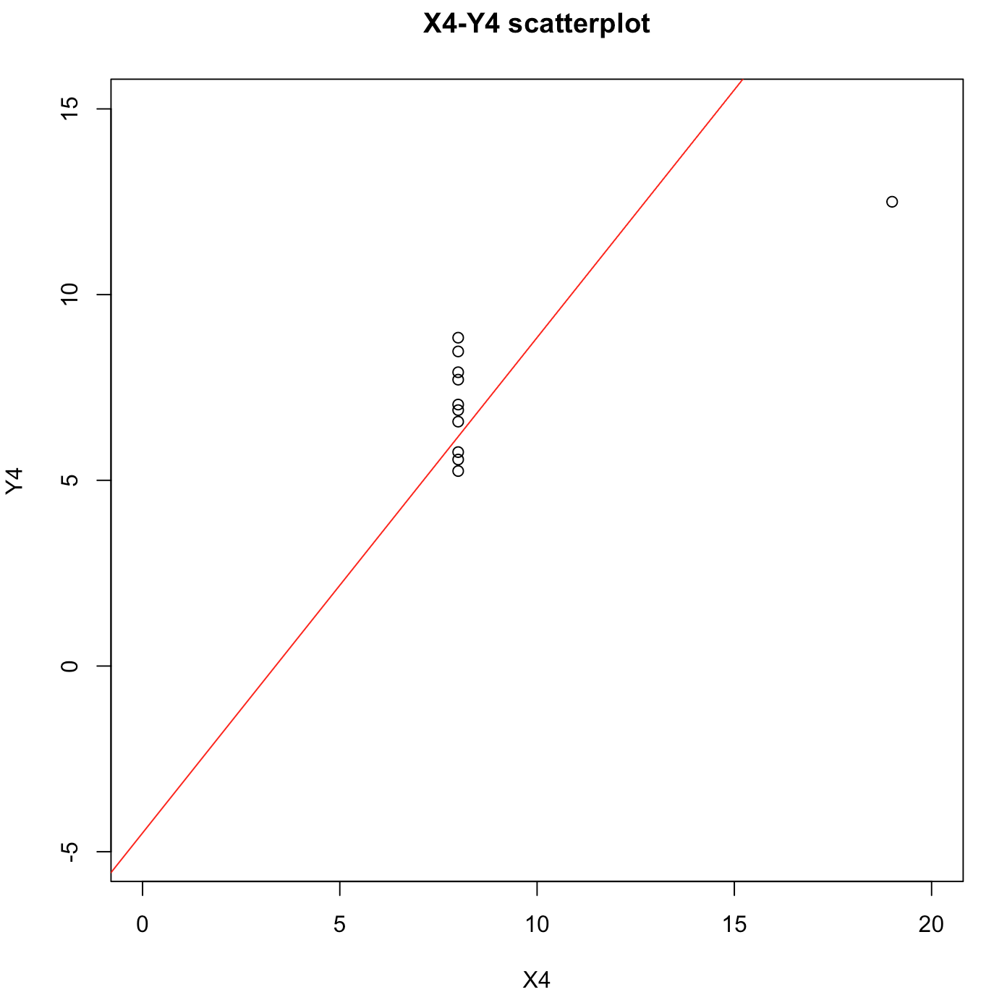


