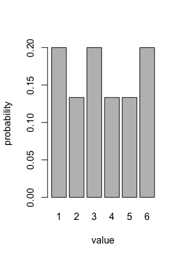

#Data Mining and Machine Learning in Bioinformatics  
##Exercise Series 3

Group members (Name, Student ID, E-Mail):  

* Baldomero Valdez,  Valenzuela, 2905175, baldmer.w@gmail.com
* Omar Trinidad Gutierrez Mendez, 2850441, omar.vpa@gmail.com
* Shinho Kang, 2890169, wis.shinho.kang@gmail.com

- - -

##Task 4

######CODE

	# Parameters
	#   m: sample matrix
	#   p: probability vector
	#   n: number of trials
	multinom <- function(m, p, n) {
	  #   - the expectation value
	  ex <- p*n
	  print ('=============================')
	  print ('Expectation Value')
	  print (ex)
	  
	  #   - the population variance/covariance matrix
	  var_m<-n*p*(1-p)
	  print ('=============================')
	  print ('Population variance')
	  print (var_m)
	  
	  cov_m<-matrix(0,ncol=6,nrow=6)
	  for (i in 1:length(p)) {
	    for (j in 1:length(p)) {
	      #print (-1 * n * i * j)
	      cov_m[i,j] <- (-1 * n * p[i] * p[j])
	    }
	  }
	  print ('=============================')
	  print ('Population covariance matrix')
	  print (cov_m)
	  
	  #   - the sample mean (R functions apply and mean)
	  print ('=============================')
	  print ('Sample Mean')
	  print (apply(m, 2, mean))
	  #apply(m,1,function(x) sum(x*c(1,2,3,4,5,6))/n)
	  
	  #   - the sample covariance matrix (R function cov)
	  print ('=============================')
	  print ('Sample Covariance Matrix')
	  print (cov(m))
	  
	  #   - the value of the probability mass function for each sample (Tip: you can use R function dmultinom)
	  print ('=============================')
	  print ('Value of the probability mass function')
	  print (apply(m, 1, function(x) dmultinom(x, prob=p)))
	  
	  # visualizing p
	  barplot(p, xlab = "value", ylab="probability", axisnames = T, names.arg = c(1,2,3,4,5,6))
	}
	
	
	# probability vector
	p <- c(0.2,0.4/3,0.2,0.4/3,0.4/3,0.2)
	# number of trials
	n <- 10
	# sample matrix - 50 random drawings from the multinomial distribution, transpose the matrix (row=sample vector)
	m<-t(rmultinom(50, n, p))
	
	multinom(m,p,n)

######RESULT

	[1] "============================="
	[1] "Expectation Value"
	[1] 2.000000 1.333333 2.000000 1.333333 1.333333 2.000000

	[1] "============================="
	[1] "Population variance"
	[1] 1.600000 1.155556 1.600000 1.155556 1.155556 1.600000

	[1] "============================="
	[1] "Population covariance matrix"
	           [,1]       [,2]       [,3]       [,4]       [,5]       [,6]
	[1,] -0.4000000 -0.2666667 -0.4000000 -0.2666667 -0.2666667 -0.4000000
	[2,] -0.2666667 -0.1777778 -0.2666667 -0.1777778 -0.1777778 -0.2666667
	[3,] -0.4000000 -0.2666667 -0.4000000 -0.2666667 -0.2666667 -0.4000000
	[4,] -0.2666667 -0.1777778 -0.2666667 -0.1777778 -0.1777778 -0.2666667
	[5,] -0.2666667 -0.1777778 -0.2666667 -0.1777778 -0.1777778 -0.2666667
	[6,] -0.4000000 -0.2666667 -0.4000000 -0.2666667 -0.2666667 -0.4000000

	[1] "============================="
	[1] "Sample Mean"
	[1] 2.40 1.28 2.04 1.10 1.26 1.92

	[1] "============================="
	[1] "Sample Covariance Matrix"
	           [,1]        [,2]        [,3]        [,4]          [,5]          [,6]
	[1,]  2.2448980 -0.62448980 -0.26122449 -0.14285714 -0.3510204082 -0.8653061224
	[2,] -0.6244898  1.06285714 -0.01142857 -0.08979592 -0.3191836735 -0.0179591837
	[3,] -0.2612245 -0.01142857  1.34530612 -0.10612245 -0.4800000000 -0.4865306122
	[4,] -0.1428571 -0.08979592 -0.10612245  0.94897959 -0.3122448980 -0.2979591837
	[5,] -0.3510204 -0.31918367 -0.48000000 -0.31224490  1.4616326531  0.0008163265
	[6,] -0.8653061 -0.01795918 -0.48653061 -0.29795918  0.0008163265  1.6669387755

	[1] "============================="
	[1] "Value of the probability mass function"
	[1] 8.601600e-04 7.645867e-05 7.645867e-04 1.146880e-03 4.587520e-03 2.293760e-03 3.058347e-03 2.293760e-03 9.061768e-05
	[10] 2.293760e-03 3.398163e-04 1.019449e-03 3.058347e-03 7.645867e-04 1.146880e-03 8.601600e-04 5.097244e-04 3.058347e-03
	[19] 1.529173e-03 1.529173e-03 1.529173e-03 3.440640e-04 8.601600e-04 1.146880e-03 6.881280e-04 1.529173e-03 1.019449e-03
	[28] 2.548622e-04 1.529173e-03 1.146880e-03 5.734400e-05 1.699081e-04 1.146880e-03 1.146880e-03 1.019449e-03 1.146880e-03
	[37] 1.019449e-03 4.587520e-04 4.530884e-04 3.398163e-04 8.601600e-04 2.548622e-04 1.529173e-03 1.529173e-03 1.146880e-03
	[46] 1.699081e-04 2.293760e-04 2.293760e-03 4.530884e-04 1.359265e-04

		
######Discussion
Everytime we draw random samples, it differed mean, variance and covariances.
With bigger number of samples, we get more closed results to the theoretically expected results.

