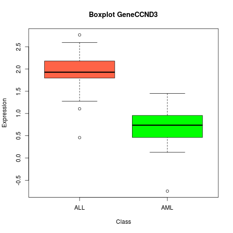
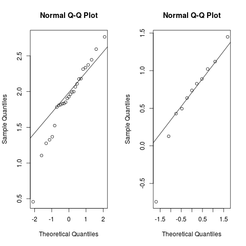

# Data Mining and Machine Learning in Bioinformatics

Group members (Name, Student ID, E-Mail):

* Shinho Kang, 2890169, wis.shinho.kang@gmail.com
* Omar Trinidad Gutierrez Mendez, 2850441, omar.vpa@gmail.com
* Baldomero Valdez,  Valenzuela, 2905175, baldmer.w@gmail.com

## Exercise Series 2

**Task 1:**

    #=========================================
    # TASK 1
    #=========================================
        sample.mean <- 4
        sample.sd <- 0.7
        n <- 5

    # a) Compute the standard error of the mean
        se <- sample.sd / sqrt(n)
    # => se : 0.3130495

    # b) Compute the 95% confidence interval
    # 2.5% quantile of t-distribution with df n-1
        t.qt <- qt(0.025, n-1)
        interval <- c(sample.mean + se*t.qt, sample.mean - se*t.qt)
        size <- interval[2] - interval[1]
    # => interval: [3.130835, 4.869165]
    # => size: [1.73833]

    # c) half the size of the confidence interval
        n2 <- 12 # or 13
        se2 <- sample.sd / sqrt(n2)
        t.qt2 <- qt(0.025, n2-1)
        interval2 <- c(sample.mean + se2*t.qt2, sample.mean - se2*t.qt2)
        size2 <- interval2[2] - interval2[1]

    # => interval2: [3.555241, 4.444759]
    # => size2: 0.8895176 (when n=12)
    # => size2: 0.8460115 (when n=13)

**Task 2:**

**a) Calculate the mean and variance of all pooled expression data:**

    library(multtest)
    data(golub)

    meanGolub = apply(golub, 1, mean)
    varGolub = apply(golub, 1, var)
    sdGolub = apply(golub, 1, sd)

**b) Means and standard deviations of the expression level for every gene for the
classes ALL and AML:**

**i. Create `glb.fac`:**

    glb.fac = factor(golub.cl, levels=0:1, labels=c("ALL", "AML"))

    meanALL = apply(golub[, glb.fac=="ALL"], 1, mean)
    sdALL = apply(golub[, glb.fac=="ALL"], 1, sd)
    meanAML = apply(golub[, glb.fac=="AML"], 1, mean)
    sdAML = apply(golub[, glb.fac=="AML"], 1, sd)

**ii. 5 genes with the largest mean expression for ALL:**

    largestALL = order(meanALL, decreasing = T)
    print(golub.gnames[largestALL[1:5], 2])

**Result:**

    [1] "5 genes with the largest mean expression for ALL"
    [1] "GB DEF = Chromosome 1q subtelomeric sequence D1S553"
    [2] "37 kD laminin receptor precursor/p40 ribosome associated protein gene"
    [3] "RPS14 gene (ribosomal protein S14) extracted from Human ribosomal protein S14 gene"
    [4] "GAPD Glyceraldehyde-3-phosphate dehydrogenase"
    [5] "ACTB Actin, beta"

**ii. 5 genes with the largest mean expression for AML:**

    largestAML = order(meanAML, decreasing = T)
    print(golub.gnames[largestAML[1:5], 2])

**Result:**

    [1] "5 genes with the largest mean expression for AML"
    [1] "GB DEF = mRNA fragment for elongation factor TU (N-terminus)"
    [2] "GB DEF = HLA-B null allele mRNA"
    [3] "Globin, Beta"
    [4] "Enhancer of rudimentary homolog mRNA"
    [5] "RPS14 gene (ribosomal protein S14) extracted from Human ribosomal protein S14 gene"

**iii. 5 oncogenes with the largest mean expression for ALL:**

    # selection of the oncogene
    oncogenes = grep('oncogene', golub.gnames[ , 2], ignore.case = T)

    meanOncoALL = apply(golub[oncogenes, glb.fac=="ALL"], 1, mean)
    largestOncoALL = order(meanOncoALL, decreasing = T)
    loncoALL = oncogenes[largestOncoALL[1:5]]
    print("5 oncogenes with the largest mean expression for ALL")
    print(golub.gnames[loncoALL, 2])

**Result:**

    [1] "5 oncogenes with the largest mean expression for ALL"
    [1] "Cellular oncogene c-fos (complete sequence)"
    [2] "GB DEF = VAV oncogene"
    [3] "FYN FYN oncogene related to SRC, FGR, YES"
    [4] "Proto-oncogene BCL3 gene"
    [5] "JUNB Jun B proto-oncogene"

**iii. 5 oncogenes with the largest mean expression for AML:**

    meanOncoAML = apply(golub[oncogenes, glb.fac=="AML"], 1, mean)
    largestOncoAML = order(meanOncoAML, decreasing = T)
    loncoAML = oncogenes[largestOncoAML[1:5]]
    print("5 oncogenes with the largest mean expression for AML")
    print(golub.gnames[loncoAML, 2])

**Result:**

    [1] "5 oncogenes with the largest mean expression for AML"
    [1] "PIM1 Pim-1 oncogene"
    [2] "JUNB Jun B proto-oncogene"
    [3] "Proto-oncogene BCL3 gene"
    [4] "Cellular oncogene c-fos (complete sequence)"
    [5] "JUNB Jun B proto-oncogene"

**iv. Genes with largest different in expression between the two classes:**

    difference <- order(abs(meanAML-meanALL), decreasing=TRUE)

    # print this on a file
    names = golub.gnames[difference[1:5], 2]
    mean = meanGolub[difference[1:5]]
    standard_deviation = sdGolub[difference[1:5]]
    data_frame = data.frame(names, mean, standard_deviation)
    write.csv(data_frame, file = "Ex4_2b_iv.csv")

**2c. Select gene 1042**

    geneCCND3 = split(golub[1042, ], glb.fac)

**i. Boxplot for the expression data**

    boxplot(golub[1042,] ~ glb.fac,
            main="Boxplot GeneCCND3",
            xlab="Class",
            ylab="Expression",
            col=c("tomato", "green")
            )

**ii. Q-Q plot with theoretical normal distribution:**

    par(mfrow=c(1, 2))

    qqnorm(geneCCND3$ALL)
    qqline(geneCCND3$ALL)
    qqnorm(geneCCND3$AML)
    qqline(geneCCND3$AML)

**iii. We have to apply the unpaired two-sample t-test, we can see that
the size and variance of the two groups are different:**

    length(geneCCND3$AML) == length(geneCCND3$ALL)
    var(geneCCND3$AML) == var(geneCCND3$ALL)

**so, we can apply the Welch t-test**

    ttest = t.test(geneCCND3$AML, geneCCND3$ALL)

**iv. Use a non-parametric test. The Kolmogorov-Smirnov test**

    kolmogorov = ks.test(geneCCND3$AML, geneCCND3$ALL)

    # Shapiro-wilk test
    a = shapiro.test(geneCCND3$AML)
    b = shapiro.test(geneCCND3$ALL)

**2d. Perform t-test for all genes comparing the distributions for ALL and AML.**

    pvalues <- apply(golub, 1, function(x) t.test(x ~ glb.fac)$p.value)

**i. comparison of p-value and alpha, if p-value < 0.05 we find a significant
difference**

    alpha = 0.05
    results = table(pvalues < alpha)
    total_i = results[names(results) == T]
    print("Genes with significant differences are in total:")
    print(total_i)

**Result:**

    [1] "Genes with significant differences are in total:" 1078

**ii. Given that we have more hypothesis, we increase the likelihood of a rare
event, then we increase the likelihood of incorrectly rejecting a null
hypothesis.**

**iii. Using Bonferroni correction we will redefine the alpha value alpha = alpha
/ number of samples**

    bonferroni = alpha/nrow(golub)
    conf_level = 1 - bonferroni

    # modify the alpha value with the parameter conf.level in t.test function
    pvalues <- apply(golub, 1, function(x) t.test(x ~ glb.fac, conf.level=conf_level)$p.value)
    results = table(pvalues < bonferroni)

    total_iii = results[names(results) == T]
    print("Genes with significant differences are in total:")
    print(total_iii)

**Result:**

    [1] "Genes with significant differences are in total:" 103

**Task 3:**

    #=========================================
    # TASK 3
    #=========================================
    # original data

    species.richness <- c(32, 29, 35, 36, 41)
    lake.area <- c(2.0, 0.9, 3.1, 3.0, 3.0)

    # pearson's correlation - original
    cor.original <- cor(species.richness, lake.area)

    # 1000 times of permutations
    N <- 1000
    cnt <- 0
    for (i in 1:N) {
      # randomly sampling vectors
      species.richness.random <- sample(species.richness)
      lake.area.random <- sample(lake.area)
      
      # pearson's correlation - random
      cor.random <- cor(species.richness.random, lake.area.random)
      
      # if cor.random is greater than or equal to cor.original
      # count variable + 1
      if (cor.random >= cor.original) {
        cnt <- cnt+1
      }
    }
    print ("===============")
    print (paste("P-Value: ", cnt/N))

