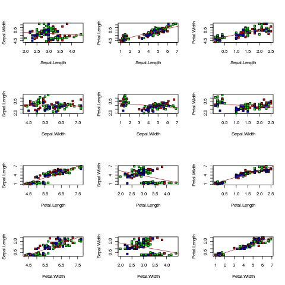

# Data Mining and Machine Learning in Bioinformatics  
## Exercise Series 5

Group members (Name, Student ID, E-Mail):  

* Baldomero Valdez,  Valenzuela, 2905175, baldmer.w@gmail.com
* Omar Trinidad Gutierrez Mendez, 2850441, omar.vpa@gmail.com
* Shinho Kang, 2890169, wis.shinho.kang@gmail.com

- - -
###Task 1:	
	preg.week = c(18,24,30,34,40)
	elt.year = c(18,26,30,40,70)
	
	#======================================
	# Calculate values MANUALLY
	#mean(preg.week) = 29.2
	preg.week.mean = sum(preg.week) / 5
	#mean(elt.year) = 36.8
	elt.year.mean = sum(elt.year) / 5
	
	#var(preg.week) = 73.2
	preg.week.var = 1/4*sum((preg.week-preg.week.mean)**2)
	#var(elt.year) = 407.2
	#elt.year.var = 1/4*sum((elt.year-elt.year.mean)**2)
	
	#cov(preg.week, elt.year) = 158.8
	preg.elt.cov = 1/4*sum((preg.week-preg.week.mean)*(elt.year-elt.year.mean))
	

**a) Determine the coefficients of the linear regression**
	
	# y_i = Beta_0 + Beta*x_i + Epsilon_i
	#   =>  least squares fit
	#   => Beta = Cov(x,y) / Var(x), Beta_0 = mean(y) - Beta*mean(x)
	# here, x is preg.week, y is elt.year.
	beta = preg.elt.cov / preg.week.var # 2.169399
	beta_0 = elt.year.mean - beta*preg.week.mean # 26.54645
	#summary(lm(elt.year~preg.week))
	
**b) residual variance**

	# residual variance = Eta^2 = 1/(n-2)*sum((y_i - Beta_0 - Beta*x_i)**2)
	residual.variance = 1/3 * sum((elt.year - beta_0 - beta * preg.week)**2) # 83.59927
	
**c) standard error of the slope coefficient Beta**

	# se(Beta) = sqrt(residual.variance) * sqrt(1/((n-1)*var(x)))
	se.beta = sqrt(residual.variance / (4*preg.week.var) ) # 0.5343376

**d) 95% confidence interval for the slope coefficient**
  
	# [Beta - se(Beta)*abs(qt(0.025, n-2)), Beta + se(Beta)*abs(qt(0.025, n-2))]
	interval =  beta + se.beta * qt(c(0.025, 0.975), 3) # 0.4688983 3.8698995

### Task 2

    # import package nnet to implement multinomial logistic regression
    library(nnet)

    # 1. Fit a logistic regression model on iris dataset
    # Multinomial logistic regression with nnet package
    data(iris)

    # shuffle the dataset and get training and test dataset
    shuffled.iris <- iris[sample(1:nrow(iris)), ]
    test.ds <- shuffled.iris[1:30,]
    training.ds <- shuffled.iris[31:150,]

    formula <- Species ~ Sepal.Length + Sepal.Width + Petal.Length + Petal.Width
    multinomial.model <- multinom(formula, training.ds)
    print(multinomial.model)

    #Call:
    #multinom(formula = formula, data = training.ds)
    #
    #Coefficients:
    #           (Intercept) Sepal.Length Sepal.Width Petal.Length Petal.Width
    #versicolor    15.78584    -5.753264   -6.333713     12.78611   -2.309163
    #virginica    -22.61359    -8.586707  -12.026601     22.15053   13.246169
    #
    #Residual Deviance: 11.38084 
    #AIC: 31.38084 

    e = predict(multinomial.model)

    # Binomial logistic regression using `glm` function

    # for setosa
    setosa.ds = shuffled.iris
    training.setosa <- setosa.ds[31:150,]
    newcol <- data.frame(isSetosa=(training.setosa$Species == 'setosa'))
    training.setosa <- cbind(training.setosa, newcol)

    formula <- isSetosa ~ Sepal.Length + Sepal.Width + Petal.Length + Petal.Width
    model.setosa <- glm(formula, data=training.setosa, family='binomial')
    print(model.setosa)
    #Call:  glm(formula = formula, family = "binomial", data = training.setosa)
    #
    #Coefficients:
    # (Intercept)  Sepal.Length   Sepal.Width  Petal.Length   Petal.Width  
    #       8.083         4.034        11.240       -22.097        -4.758  
    #
    #Degrees of Freedom: 119 Total (i.e. Null);  115 Residual
    #Null Deviance:      152.8 
    #Residual Deviance: 2.285e-09    AIC: 10
    e = predict(model.setosa, newdata=test.ds, type='response')

    # for versicolor
    versicolor.ds = shuffled.iris
    training.versicolor <- versicolor.ds[31:150,]
    newcol <- data.frame(isVersicolor=(training.versicolor$Species == 'versicolor'))
    training.versicolor <- cbind(training.versicolor, newcol)

    formula <- isVersicolor ~ Sepal.Length + Sepal.Width + Petal.Length + Petal.Width
    model.versicolor <- glm(formula, data=training.versicolor, family='binomial')
    print(model.versicolor)
    #Call:  glm(formula = formula, family = "binomial", data = training.versicolor)
    #
    #Coefficients:
    # (Intercept)  Sepal.Length   Sepal.Width  Petal.Length   Petal.Width  
    #      7.7785       -0.3307       -2.7866        1.2605       -2.5890  
    #
    #Degrees of Freedom: 119 Total (i.e. Null);  115 Residual
    #Null Deviance:      152.8 
    #Residual Deviance: 115.4        AIC: 125.4
    e = predict(model.versicolor, newdata=test.ds, type='response')

    # for virginica
    virginica.ds = shuffled.iris
    training.virginica <- virginica.ds[31:150,]
    newcol <- data.frame(isVirginica=(training.virginica$Species == 'virginica'))
    training.virginica <- cbind(training.virginica, newcol)

    formula <- isVirginica ~ Sepal.Length + Sepal.Width + Petal.Length + Petal.Width
    model.virginica <- glm(formula, data=training.virginica, family='binomial')
    print(model.virginica)

    #Call:  glm(formula = formula, family = "binomial", data = training.virginica)
    #
    #Coefficients:
    # (Intercept)  Sepal.Length   Sepal.Width  Petal.Length   Petal.Width  
    #     -38.802        -2.830        -5.672         9.420        15.584  
    #
    #Degrees of Freedom: 119 Total (i.e. Null);  115 Residual
    #Null Deviance:      152.8 
    #Residual Deviance: 11.38        AIC: 21.38
    e = predict(model.virginica, newdata=test.ds, type='response')

### Task 3

    par(mfrow=c(4, 3))
    labels = names(iris)[-5]
    indexes = c(1:4)
    for (x in indexes) {
        for (y in indexes) {
            if (x != y) {
                a = training.ds[,x]
                b = training.ds[,y]
                plot(a~b,
                     pch = 22,
                     bg = c('red', 'green', 'blue')[unclass(iris$Species)],
                     xlab = labels[x],
                     ylab = labels[y]
                     # xlim = c(0,7),
                     # ylim = c(0,7)
                     )
                model = lm(a~b)
                abline(model, col='brown')
            }
        }
    }

    # Because each of the plots show a correlation between the columns we can
    # conclude that one of the predictors can be expressed as a linear combination
    # of the others.

### Task 4

    # preparing the data for ANOVA analysis, the data is needed in long format
    
    measures <- c(
      3.3, 2.3, 2.5, 1.3, 2, 1.5,          # Stim 1
      1.2, 0.9, 1.5, 1.5, 0.7, 1.8,        # Stim 2  
      3.2, 4.0, 2.7, 3, 3.5, 3.3)          # Stim 3    
    
    # stimulation conditions
    
    stim <- factor(c(rep(1,6), rep(2,6), rep(3,6)))
    
    # cell line (A=1, B=2)
    
    cellLine <- c(rep(1,3), rep(2,3), rep(1,3), rep(2,3), rep(1,3), rep(2,3))
    
    # combine the data into a data frame
    
    gene <- data.frame(cbind(measures, stim, cellLine))
    
    boxplot(gene$measures~gene$cellLine*gene$stim)
    
    #tapply(gene$measures, list(stim), mean)
    #tapply(gene$measures, list(cellLine), mean)
    #tapply(gene$measures, list(stim, cellLine), mean)
    
    fit <- lm(gene$measures~gene$cellLine*gene$stim)
    fit
    
    # Coefficients:
    #  (Intercept)            gene$cellLine                    gene$stim  
    # 3.2000 (1st group avg)  -1.4000 (diff 2nd group to 1st)  -0.2333 (diff 3rd group to 1st) 
    # Analysis of Variance
    # group means are not significantly different
    # null hypothesis: there is no difference across the levels of cell line/stim,
    # reject if Pr(>F) is highly significant. 

    # Both hypothesis could not be rejected.
    
    #aov2 <- aov(measures~cellLine+stim+cellLine:stim, data=gene)
    #summary(aov2)
    anova(fit)
    
    # residual interaction between cellLine and stim
    # boxplot(residuals(fit)~cellLine*stim)
    
    # difference between observed values and fitted values
    
    residuals(fit)
    #summary(fit)
    plot(fit)
