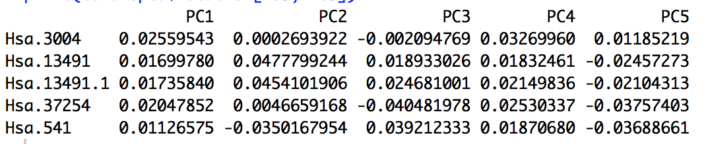
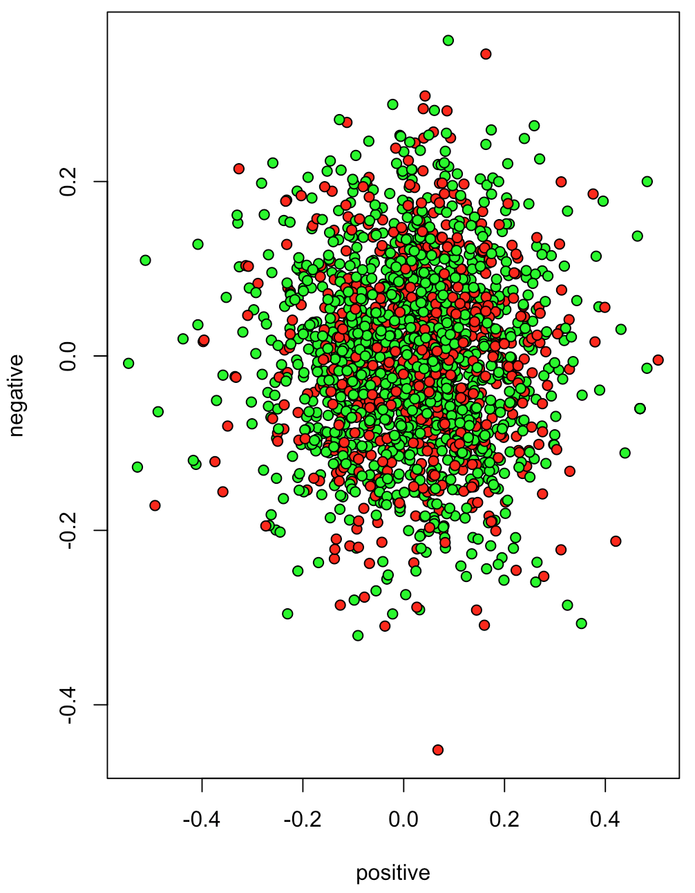
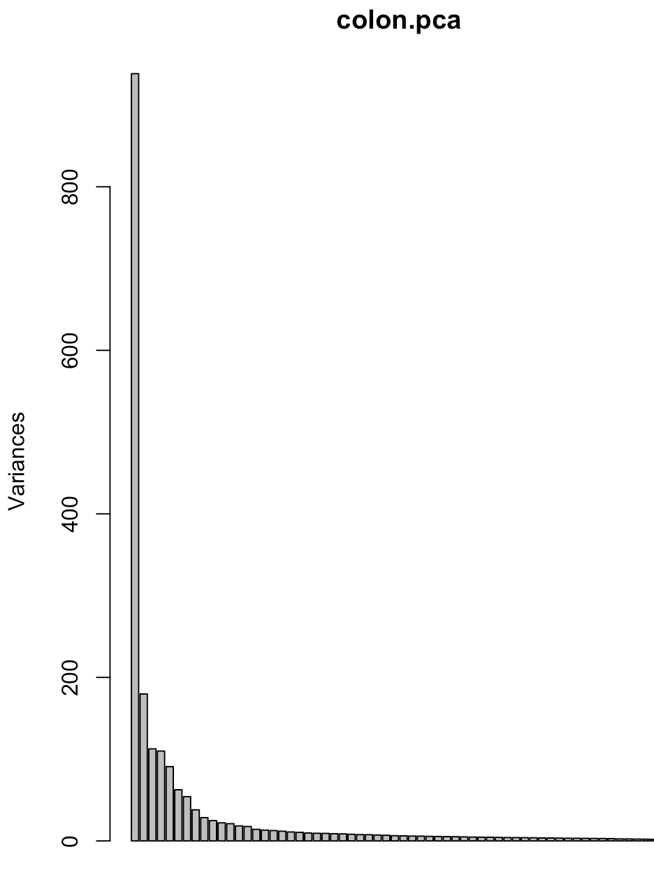
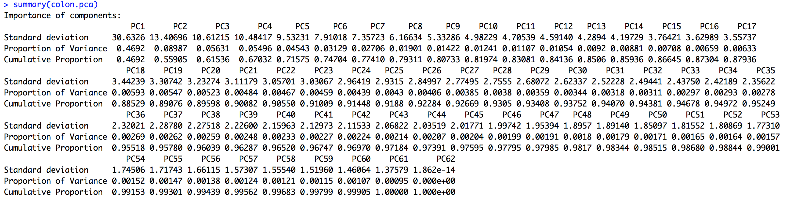

# Data Mining and Machine Learning in Bioinformatics  
## Exercise Series 6

Group members (Name, Student ID, E-Mail):  

* Baldomero Valdez,  Valenzuela, 2905175, baldmer.w@gmail.com
* Omar Trinidad Gutierrez Mendez, 2850441, omar.vpa@gmail.com
* Shinho Kang, 2890169, wis.shinho.kang@gmail.com

- - -
###Task 1:	
#### A) Load `colonCA` dataset and use the function prcomp to calculate the PCA

	library(colonCA)
	data(colonCA)
	
	colon.ds = log(exprs(colonCA))
	colon.ds = t(colon.ds)
	
	colon.pca = prcomp(colon.ds,
	                   center = TRUE,
	                   scale. = TRUE
	                   )
	print(colon.pca$rotation[1:5, 1:5])
	
	> print(colon.pca$rotation[1:5, 1:5])

#### B) 2D PCA plot from normal patients and patients with cancer

	negative = apply(colon.pca$rotation[, colonCA$class == 'n'], 1, sum)
	positive = apply(colon.pca$rotation[, colonCA$class == 't'], 1, sum)
	
	plot(negative ~ positive,
	     pch = 21,
	     bg = c('red', 'green')[unclass(colonCA$class)])

#### C) screeplot of eigenvalues

	# colon.pca contains a `sdev` component
	screeplot(colon.pca, npcs = 62)

#### D) principal components analysis
	summary(colon.pca)

* Which proportion of the overall variance do the first 2 principal components explain?  => 0.55905
* How many principal components would you need to explain 90% and 95% of the overall variance?
	* To explain 90% we need the first 21 PCA whose cumulative proportion is 0.90082
	* To explain 95% we need the first 34 PCA whose cumulative proportion is 0.94972
