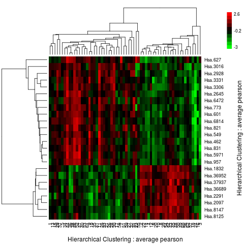
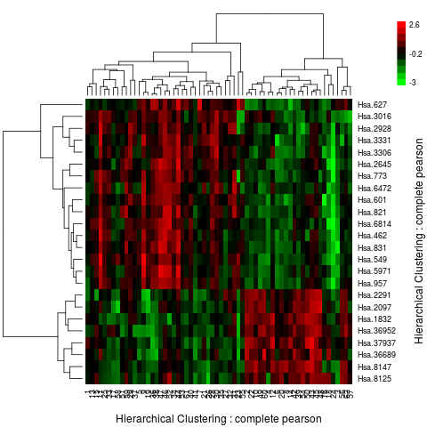
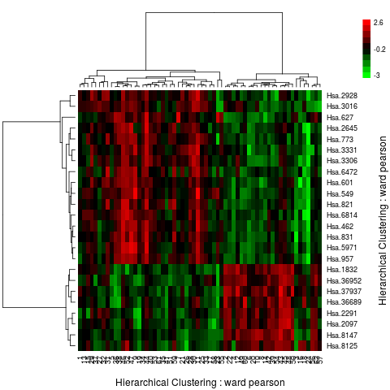

# Data Mining and Machine Learning in Bioinformatics
## Exercise Series 7

Group members (Name, Student ID, E-Mail):

* Baldomero Valdez,  Valenzuela, 2905175, baldmer.w@gmail.com
* Omar Trinidad Gutierrez Mendez, 2850441, omar.vpa@gmail.com
* Shinho Kang, 2890169, wis.shinho.kang@gmail.com

- - -

### Task 1:

#### A)  perform an unpaired `t-test` on colonCA ( ____/2 )

    data(colonCA)
    colon.ds = log(exprs(colonCA))
    colon.ds = as.data.frame(colon.ds)

    pvalues <- apply(colon.ds, 1,
                     function(x) t.test(x ~ colonCA$class)$p.value)
    alpha = 0.0001
    diff.exp = colon.ds[pvalues <= alpha,]

#### B) Install EMA package, do clustering and produce heatmaps (____ /4 )

Install EMA package is a tedious process, first install biomaRt dependencies:

- Ubuntu: sudo apt-get install libcurl4-openssl-dev libxml2-dev
- install.packages("XML")
- install.packages("RCurl")

After that install EMA dependencies and EMA library:

- source("https://bioconductor.org/biocLite.R")
- biocLite("biomaRt")
- biocLite("affy")
- biocLite("siggenes")
- biocLite("gcrma")
- biocLite("AnnotationDbi")
- install.packages("EMA")

Here the code:

    cluster.complete.genes = clustering(diff.exp, metric="pearson",  method = "complete")
    cluster.complete.samples = clustering(t(diff.exp), metric="pearson",  method = "complete")

    cluster.average.genes = clustering(diff.exp, metric="pearson", method = "average")
    cluster.average.samples = clustering(t(diff.exp), metric="pearson", method = "average")

    cluster.ward.genes = clustering(diff.exp, metric="pearson", method = "ward")
    cluster.ward.samples = clustering(t(diff.exp), metric="pearson", method = "ward")

    # Heatmap for cluster with average linkage
    clustering.plot( tree = cluster.average.genes, tree.sup = cluster.average.samples, data = diff.exp)

    # Heatmap for cluster with complete linkage
    clustering.plot( tree = cluster.complete.genes, tree.sup = cluster.complete.samples, data = diff.exp)

    # Heatmap for cluster with Ward's method
    clustering.plot( tree = cluster.ward.genes, tree.sup = cluster.ward.samples, data = diff.exp)

The dendogram visualization shows that clustering with average and complete
linkage produce a similar result. The dendogram for Ward's method shows that
this clustering grouping produce fewer levels.

#### C) Comparison between Pearson correlation and Euclidean distance (____ /2 )

When clustering colonCA data it is better to use Pearson correlation as
distance because we are comparing the similarity between several dimensions.
Another advantage from Pearson correlation over Euclidean distance: is unit
independent.
