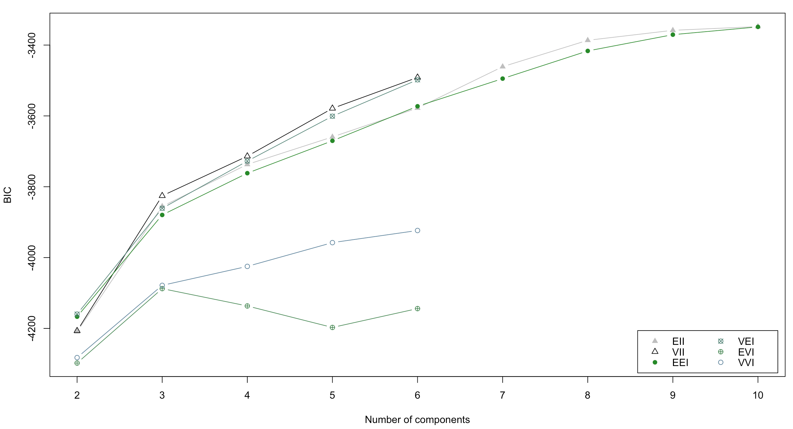

# Data Mining and Machine Learning in Bioinformatics
## Exercise Series 8

Group members (Name, Student ID, E-Mail):

* Baldomero Valdez,  Valenzuela, 2905175, baldmer.w@gmail.com
* Omar Trinidad Gutierrez Mendez, 2850441, omar.vpa@gmail.com
* Shinho Kang, 2890169, wis.shinho.kang@gmail.com

- - -

## Task 7-2:

**A) GMM - cluster patients in one of two categories on the basis of expressions from 25 genes.**

i) Degrees of freedom: 

n(π_k) = 25, n(μ_k) = 25, n(∑) = 25 x 25, where n(p) is number of adjustable parameter p   
totally, 25+25+(25x25) = **675**

ii) with diagonal covariance matrix

n(π_k) = 25, n(μ_k) = 25, n(∑) = 25
totally, 25+25+25 = **75**

iii) no correlation, the variation for each gene is same for each Gaussian.

n(π_k) = 25, n(μ_k) = 25
totally, 25+25 = **50**

**B) GMM clustering**

	#install.packages("mclust")
	library(mclust)
	library(colonCA)

	data(colonCA)
	colon.ds <- log(exprs(colonCA))
	
	pvalues <- apply(colon.ds, 1, function(x) {
	  return (t.test(x[colonCA$class=='t'], x[colonCA$class=='n'])$p.value)
	})
	alpha = 0.0001
	colon.signif = colon.ds[pvalues <= alpha,]

i) patients based on their gene expression profiles

	cl1 = Mclust(t(colon.signif), G=2:10)
	summary(cl1)
	plot(cl1,  what = "BIC")
	
	
ii) differentially expressed genes based on their profiles across patients	

	cl2 = Mclust(colon.signif, G=2:10)
	summary(cl2)
	plot(cl2,  what = "BIC")

RESULT  

* GMM for patients: Mclust VVE (ellipsoidal, equal orientation) model with **2 components**, with BIC **-2652.285**  

* GMM for genes: Mclust EII (spherical, equal volume) model with **10 components**, with BIC **-3347.762**  

**C) GMM clustering - Standardized gene expressions**

	scaled.colon.signif <- scale(colon.signif, center=TRUE, scale=TRUE)
	
i) GMM for patients

	cl3 = Mclust(t(scaled.colon.signif), G=2:10)
	summary(cl3)
	plot(cl3,  what = "BIC")
	plot(cl3,  what = "classification")
	
ii) GMM for genes

	cl4 = Mclust(scaled.colon.signif, G=2:10)
	summary(cl4)
	plot(cl4,  what = "BIC")
	plot(cl4,  what = "classification")

RESULT

* GMM for patients: Mclust VEI (diagonal, equal shape) model with **3 components**, with BIC **-2107.218**

24 variables

* GMM for genes: Mclust EII (spherical, equal volume) model with **10 components**, with BIC **-3183.784**

62 variables

**D) Comparing above clusterings**

* GMM for patients
	* b) **2 components**, with BIC **-2652.285**
	* c) **3 components**, with BIC **-2107.218**
* GMM for genes
	* b) **10 components**, with BIC **-3347.762**
	* c) **10 components**, with BIC **-3183.784**

For genes, it is difficult to say that using standardized data makes big difference. It probably over-fitted with 10 components.  
For patients, standardizing made a bigger number of clusters than the clustering without standardizing.  

Standardizing data is recommended because otherwise the range of values in each feature will act as a weight when determining how to cluster data, which is typically undesired.  
If one of the features has a range of values much larger than the others, clustering will be completely dominated by that one feature.

**E) silhouettes**

## Task 8:

**1.a**

	library(GSVAdata)
	data(gbm_VerhaakEtAl)
	
	# gbm_eset
	# head(pData(gbm_eset))
	
	# get genes expressions, the matrix is already in the proper format.
	
	data_gbm = exprs(gbm_eset)
	# data_gbm[1:5,1:3]
	
	# For the purpose of selecting the most informative genes for class detection,
	# we reduce the dataset to the top 2,000 most variable genes, measured by median
	# absolute deviation. 
	
	mads = apply(data_gbm,1,mad)
	data_gbm = data_gbm[rev(order(mads))[1:2000],]

**result**

	GABRB1                    0.88844            -0.07679
	CHI3L2                    0.26796             0.25706
	AQP1                     -0.58220            -0.50364
	SNAP25                   -0.27376            -2.00055
	FCGR2B                    1.16052            -0.03571
	CXCL10                    0.06882            -0.40070
	CXCL14                    0.27617             0.86518
	PLA2G5                    0.16101             1.20059
	MMP7                      0.68311            -0.28043
	 [ reached getOption("max.print") -- omitted 1943 rows ]
	 

**2.a**

	data(leukemia)
	leukemia_eset
	
	# get gene expressions
	
	data_leukemia = exprs(leukemia_eset)
	# data_leukemia[1:5,1:3]
	
	# Prioritize the gene expressions based on their median absolute deviation (MAD) and
	# select the 2000 top genes
	
	mads = apply(data_leukemia,1,mad)
	data_leukemia = data_leukemia[rev(order(mads))[1:2000],]

** result

	33781_s_at                            9.281447
	40790_at                             11.597086
	39932_at                              9.952415
	33500_i_at                           12.874146
	1226_at                               7.853077
	32434_at                              6.916666
	 [ reached getOption("max.print") -- omitted 1730 rows ]